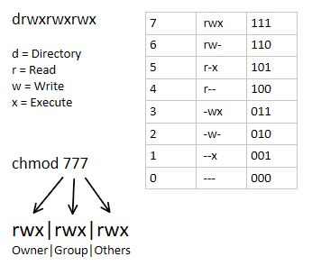

# Hadoop 필수 명령어

## hadoop command

- `ls`: 파일 목록 보기기
    - `ls`: terminal: 현재 나의 위치에 있는 모든 파일 목록을 보여줌
    - `hdfs dfs -ls /`: hadoop의 루트 폴더 있는 모든 파일 목록을 보여줌
        
        `hdfs dfs -ls <확인하고 싶은 경로>`

- `mkdir`: 폴더 생성
    - `mkdir`: terminal: 현재 나의 위치에 있는 폴더를 생성
    - `hdfs dfs -mkdir /input`: hadoop에 `input`라는 폴더를 생성

`hdfs dfs -mkdir <생성하고 싶은 폴더 이름>`

- `put`: 데이터 업로드
    - `put`: terminal: 현재 나의 위치에 있는 파일을 hadoop에 올림
    - `hdfs dfs -put ml-25m/movies.csv /input`: hadoop에 `input`라는 폴더에 `movies.csv`라는 파일을 올림

`hdfs dfs -put <업로드할 파일 경로> <hdfs 경로= 업로드할 위치>`

- `get`
    - `get`: terminal: hadoop에 있는 파일을 내 컴퓨터로 내려받음
    - `hdfs dfs -get <hdfs 경로> <내 컴퓨터에 저장할 경로

- `cat`:파일 내용 확인 (출력하고 싶은 데이터를 전체 출력)
    - `cat`: terminal: hadoop에 있는 파일을 확인
    - `hdfs dfs -cat /input/movies.csv`: hadoop에 있는 `input`폴더에 있는 `movies.csv`파일을 확인

`hdfs dfs -cat <출력하고 싶은 파일 경로>`

`head`, `tail`
    `hdfs dfs -head <출력하고 싶은 파일 경로>`
    `hdfs dfs -tail <출력하고 싶은 파일 경로>`
`hdfs dfs -head /input/movies.csv`

- `rm`: 파일 삭제
    - `rm`: terminal: hadoop에 있는 파일을 삭제
    - `hdfs dfs -rm <hdfs 경로>`
`hdfs dfs -rm /ratings.csv`

`hdfs dfs -rm <hdfs 경로>`

- `rmr`: 폴더 삭제
    - `rmr`: terminal: hadoop에 있는 폴더를 삭제
`hdfs dfs -rm -r /input

e.g. `hdfs dfs -rm -r /output/movie-rate-avg` : hadoop의 output폴더와 그 안의 movie-rate-avg라는 파일을 지움

chmod 권한 설정 
> `chmod +x mapper.py`: mapper.py 파일에 대한 x (execute 권한 추가)
> 권한 확인 `ls -l`
> 모든 권한 추가 : `chmod 777 mapper.py`
> 권한 삭제:  `chmod 755 mapper.py`
>           : `chmod -x mapper.py`: mapper.py의 execute 권한 해제

()

---
`access.log` 파일
> https://www.kaggle.com/datasets/eliasdabbas/web-server-access-logs
>
> 의 데이터가 너무 커서 일부만 잘라서 가져옴. 
> 접속 시간, 언제 가장 많이 접속했는지를 확인하려고

